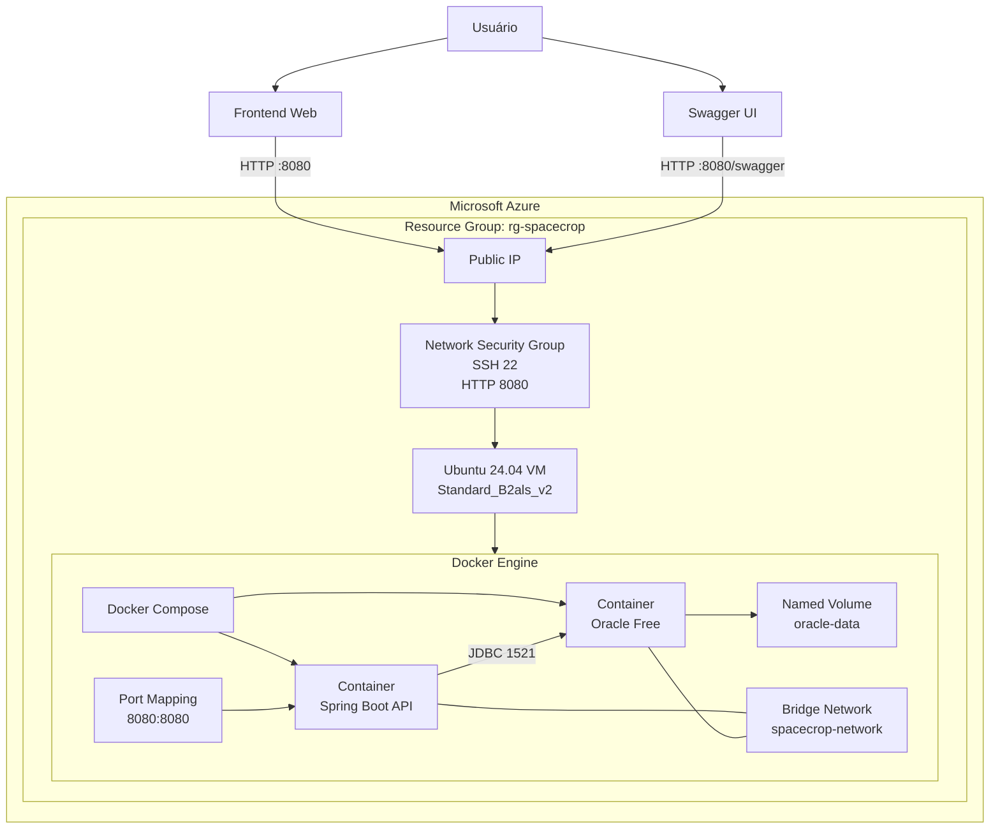

# SpaceCrop DevOps

> Global Solution 2026/1 — FIAP  
> Infraestrutura em nuvem para monitoramento agrícola inteligente utilizando Azure, Docker e Oracle Database.

---

## Integrantes

| Nome | RM |
|--------|--------|
| Lucas Grillo Alcântara | 561413 |
| Pietro Ferreira Gomes Abrahamian | 561469 |
| Pedro Peres Benitez | 561792 |
| Lucca Ramos Mussumecci | 562027 |

---

## Descrição

O SpaceCrop é uma plataforma voltada ao monitoramento agrícola por meio de dados coletados por sensores orbitais. Nesta entrega, o foco está na implantação da solução utilizando práticas de DevOps, com provisionamento de infraestrutura em nuvem, containerização, persistência de dados e disponibilização da aplicação para acesso externo.

---

## Repositório

https://github.com/lgaxd/spacecrop-devops

---

## Vídeo de Apresentação

https://www.youtube.com/watch?v=cIKP2-FXKSE

---

## Arquitetura da Solução



---

## Tecnologias Utilizadas

### Infraestrutura

- Microsoft Azure
- Azure CLI
- Ubuntu Server 24.04 LTS

### Containers

- Docker
- Docker Compose

### Banco de Dados

- Oracle Database Free 23c

### Aplicação

- Java 21
- Spring Boot
- Maven

### Documentação

- Swagger / OpenAPI

---

## Provisionamento da Infraestrutura

A infraestrutura é provisionada utilizando Azure CLI.

Recursos criados:

- Resource Group
- Máquina Virtual Ubuntu
- Public IP
- Network Security Group
- Docker Engine
- Docker Compose
- Java 21
- Maven

---

## Estrutura dos Containers

### spacecrop-api

Container responsável pela execução da API REST.

Porta exposta:

```text
8080
```

### oracle-db

Container responsável pela persistência dos dados.

Porta utilizada:

```text
1521
```

---

## Rede e Persistência

### Rede Docker

```text
spacecrop-network
```

Permite comunicação segura entre API e banco de dados.

### Volume Persistente

```text
oracle-data
```

Responsável pela persistência dos dados do Oracle Database mesmo após reinicializações.

---

## Variáveis de Ambiente

Exemplo:

```bash
export ORACLE_PASSWORD=******
export APP_USER=******
export APP_USER_PASSWORD=******

export DATABASE_URL=jdbc:oracle:thin:@oracle-db:1521/FREEPDB1
export DATABASE_USERNAME=******
export DATABASE_PASSWORD=******

export JWT_SECRET=******
export JWT_EXPIRATION=86400000
```

---

## Executando o Projeto

### Clonar o repositório

```bash
git clone https://github.com/lgaxd/spacecrop-devops.git
cd spacecrop-devops
```

### Subir os containers

```bash
docker compose up --build -d
```

### Verificar containers

```bash
docker ps
```

### Verificar logs

```bash
docker logs api-rm561413
docker logs oracle-rm561413
```

---

## Health Check

A inicialização da aplicação depende do estado saudável do banco Oracle.

Fluxo:

1. Inicialização do Oracle Database
2. Execução do Health Check
3. Inicialização da API Spring Boot
4. Disponibilização do Swagger e endpoints REST

---

## Acesso

### Swagger

```text
http://IP_DA_VM:8080/swagger
```

### API

```text
http://IP_DA_VM:8080
```

---

Desenvolvido como parte da Global Solution 2026/1 — FIAP.